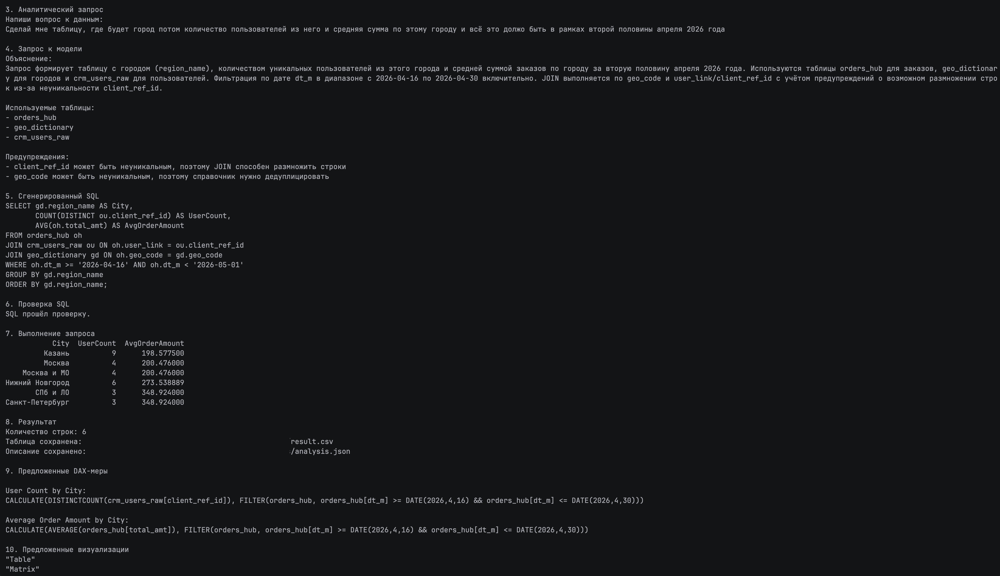

# AI Analytics CLI

Консольное приложение, которое позволяет получать информацию из данных с помощью вопросов на обычном языке.

Пользователю не нужно самостоятельно писать SQL-запросы. Достаточно запустить программу, ввести вопрос, а приложение автоматически подготовит запрос к данным, проверит его и покажет результат.

---

## О проекте

Для получения информации из базы данных обычно требуется знание SQL.

Например, чтобы узнать:

> Какие товары принесли больше всего прибыли?

аналитику или разработчику нужно определить нужные таблицы и столбцы, а затем вручную написать SQL-запрос.

Этот проект показывает другой подход.

Пользователь формулирует вопрос обычным языком, а приложение самостоятельно:

1. изучает структуру доступных данных;
2. передаёт вопрос языковой модели;
3. получает сгенерированный SQL-запрос;
4. проверяет запрос перед выполнением;
5. выполняет его в DuckDB;
6. выводит результат в терминале.

Таким образом, приложение выступает промежуточным слоем между человеком и данными.



---

## Как это работает

```text
Пользователь запускает программу
              │
              ▼
Вводит вопрос обычным языком
              │
              ▼
Программа получает структуру данных
              │
              ▼
LLM генерирует SQL-запрос
              │
              ▼
SQL проходит проверку
              │
              ▼
DuckDB выполняет запрос
              │
              ▼
Результат отображается в терминале
```

---

## Пример

Пользователь вводит:

```text
Покажи общую сумму продаж по регионам.
```

Языковая модель может сгенерировать следующий SQL-запрос:

```sql
SELECT
    region,
    SUM(sales) AS total_sales
FROM orders
GROUP BY region
ORDER BY total_sales DESC;
```

После проверки программа выполняет запрос и выводит результат:

```text
Region    Total Sales
North     125000
South      98000
West       87500
```

---

## Зачем нужен этот проект

Проект демонстрирует, как языковые модели можно применять не только для генерации текста, но и для решения практических аналитических задач.

Приложение может быть полезно как прототип инструмента для пользователей, которые работают с данными, но не пишут SQL каждый день.

Основная идея проекта:

> Снизить технический порог входа в аналитику и позволить пользователю взаимодействовать с данными на естественном языке.

---

## Почему приложение передаёт модели метаданные

Языковая модель не получает всю базу данных.

Вместо этого приложение передаёт ей только описание структуры данных:

* названия таблиц;
* названия столбцов;
* типы данных;
* доступные связи и поля.

Благодаря этому модель понимает, с какими таблицами и столбцами она может работать.

Такой подход:

* уменьшает объём передаваемой информации;
* помогает генерировать более точные SQL-запросы;
* не требует отправлять модели полное содержимое базы;
* ограничивает запросы существующей структурой данных.

---

## Почему SQL проверяется

SQL, созданный языковой моделью, нельзя выполнять без дополнительной проверки.

Модель может:

* ошибиться в названии таблицы;
* использовать несуществующий столбец;
* создать некорректный запрос;
* вернуть лишний текст вместе с SQL.

Поэтому перед выполнением приложение проверяет сгенерированный запрос.

Только после успешной проверки SQL передаётся в DuckDB.

Это делает процесс более контролируемым и снижает вероятность выполнения некорректного запроса.

---

## Роль DuckDB

DuckDB — это аналитическая база данных, которая работает непосредственно внутри Python-приложения.

В этом проекте она используется для:

* загрузки локальных данных;
* выполнения SQL-запросов;
* агрегации и фильтрации данных;
* возврата результата пользователю.

Для запуска проекта не требуется устанавливать отдельный сервер базы данных.

---

## Роль языковой модели

Языковая модель не выполняет запросы и не получает прямой доступ к базе данных.

Она используется только для преобразования вопроса пользователя в SQL.

Разделение ответственности выглядит так:

* языковая модель понимает вопрос и создаёт SQL;
* валидатор проверяет SQL;
* DuckDB выполняет SQL;
* CLI показывает результат пользователю.

---

## Основные возможности

* ввод аналитического вопроса на естественном языке;
* автоматическая генерация SQL;
* использование структуры данных при создании запроса;
* проверка SQL перед выполнением;
* выполнение аналитических запросов в DuckDB;
* отображение результата непосредственно в терминале;
* разделение программы на независимые модули.

---

## Используемые технологии

* **Python** — основной язык разработки;
* **DuckDB** — выполнение аналитических SQL-запросов;
* **OpenRouter** — доступ к языковой модели;
* **sqlglot** — разбор и проверка SQL;
* **python-dotenv** — загрузка настроек и API-ключа из переменных окружения.

---

## Структура проекта

```text
project/
│
├── main.py
├── database.py
├── metadata.py
├── llm.py
├── validator.py
├── requirements.txt
├── .env.example
└── README.md
```

Назначение основных модулей:

* **main.py** — запуск приложения и взаимодействие с пользователем;
* **database.py** — подключение к DuckDB и выполнение запросов;
* **metadata.py** — получение информации о структуре данных;
* **llm.py** — взаимодействие с языковой моделью через OpenRouter;
* **validator.py** — извлечение и проверка сгенерированного SQL.

---
## Работа
После запуска программа предложит ввести аналитический вопрос:

```text
Введите вопрос:
```

Например:

```text
Какие категории товаров принесли больше всего выручки?
```

После этого приложение сгенерирует SQL, проверит его, выполнит запрос и покажет результат в терминале.

---

## Ограничения

Это прототип, демонстрирующий основную архитектуру решения.

Текущая версия может иметь следующие ограничения:

* качество SQL зависит от выбранной языковой модели;
* приложение работает только с заранее подготовленными данными;
* сложные или неоднозначные вопросы могут потребовать уточнения;
* интерфейс доступен только через командную строку;
* проект не предназначен для выполнения изменяющих данные запросов без дополнительных ограничений.

---

## Возможные улучшения

В дальнейшем проект можно расширить:

* добавить историю запросов;
* поддержать несколько файлов и источников данных;
* улучшить обработку ошибок;
* добавить повторную генерацию некорректного SQL;
* ограничить выполнение только безопасными `SELECT`-запросами;
* добавить экспорт результата в CSV;
* создать графический или веб-интерфейс;
* подключить BI-инструменты для визуализации результатов;
* добавить автоматические тесты.
* Добавить работу с REST API

---

## Итог

Проект демонстрирует полный путь от вопроса на естественном языке до результата аналитического запроса:

```text
Вопрос пользователя
        ↓
Описание структуры данных
        ↓
Генерация SQL
        ↓
Проверка SQL
        ↓
Выполнение в DuckDB
        ↓
Результат в терминале
```

Главная ценность проекта заключается не только в использовании языковой модели, но и в построении контролируемого процесса, где модель создаёт запрос, а приложение проверяет и выполняет его отдельно.
